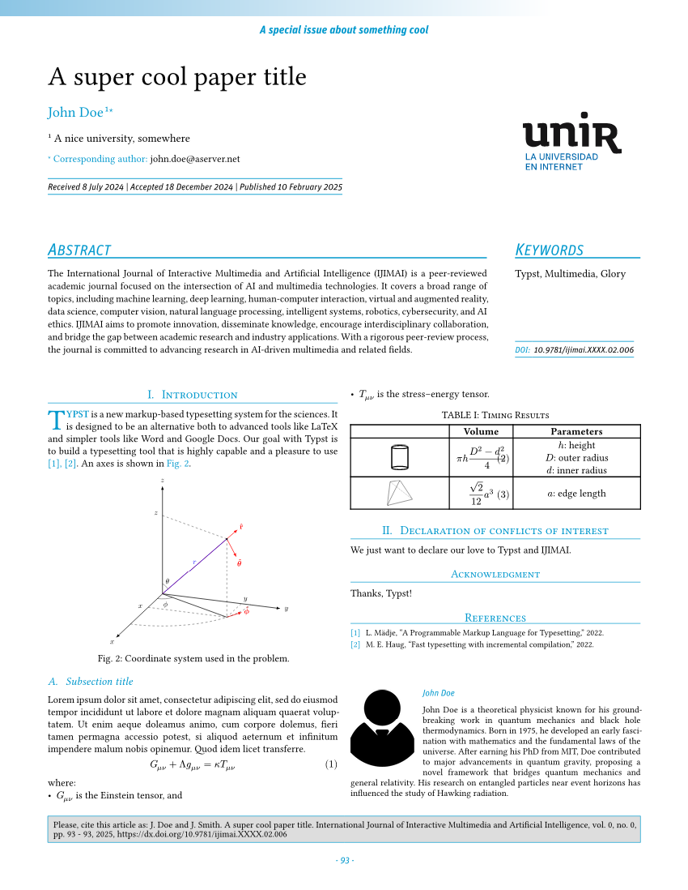
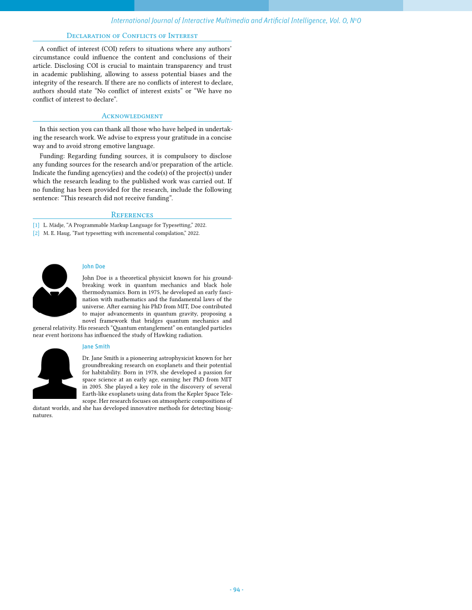
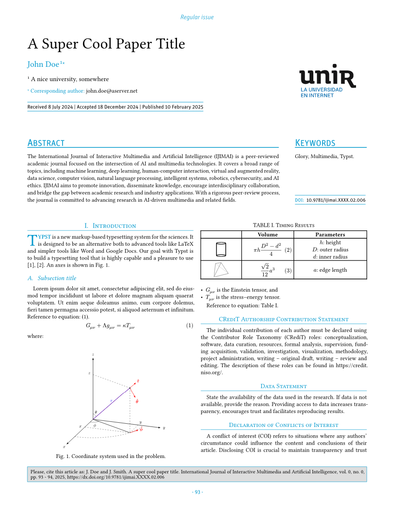
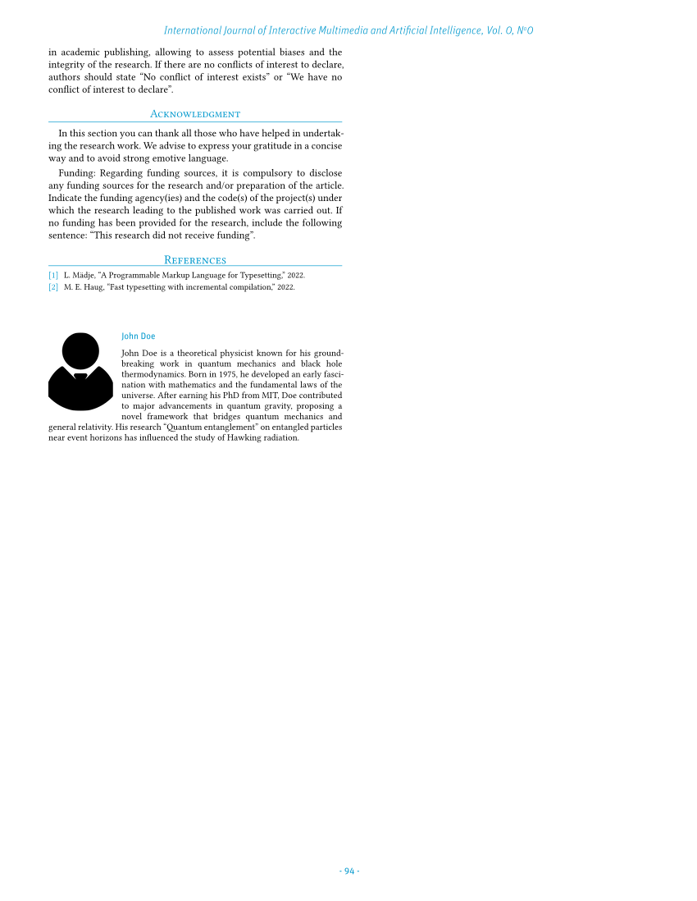

# Template for the _International Journal of Interactive Multimedia and Artificial Intelligence_ (IJIMAI)
The _International Journal of Interactive Multimedia and Artificial Intelligence_ ([IJIMAI](https://www.ijimai.org)) is a quarterly journal which provides an interdisciplinary forum in which scientists and professionals can share their research results and report new advances on artificial intelligence tools, theory, methodologies, systems, architectures integrating multiple technologies, problems including demonstrations of effectiveness, or tools that use AI with interactive multimedia techniques.

This template allows researchers to write and send papers to IJIMAI, directly written in Typst! IJIMAI is the first journal ever to accept contributions authored in Typst.

## Quick start
In order to use it, just read the TOML configuration file, import the template and apply a `show` rule:

```Typst
#import "@preview/ijimai:0.0.4": *
#let conf = toml("paper.toml")
#let author-photos = conf.authors.map(author => read(
  "photos/" + author.photo,
  encoding: none,
))
#show: ijimai.with(
  conf: conf,
  photos: author-photos,
  logo: image("unir logo.svg", width: 17.5%),
  bib-data: read("bibliography.bib", encoding: none),
)

= Introduction
#first-paragraph[Typst][is a new markup-based typesetting system for the sciences. It is designed to be an alternative both to advanced tools like LaTeX and simpler tools like Word and Google Docs.]

= CRediT authorship contribution statement
#format-credit-section()

= Data statement
= Declaration of conflicts of interest
= Acknowledgment
```

All the needed information is written in a [TOML](https://toml.io) conf file. Take a look at the example. Author photos are composed from their name and appending `.jpg` i.e., `John Doe` + `.jpg`.

If you do not have the Unit OT font, you can download it from the [repository]. Once done, upload the [`UnitOT-Regular.otf`] and [`UnitOT-LightItalic.otf`] files to your project directory in the [Typst.app](http://typst.app) web application. If you are using Typst locally, install font files in your operating system so that they are available to any program, alternatively use `--font-path` (paired with `--ignore-system-fonts`) flag and pass the directory with the downloaded fonts (see `typst compile --help`).

[`UnitOT-Regular.otf`]: https://raw.githubusercontent.com/pammacdotnet/IJIMAI/refs/heads/main/fonts/Unit OT/UnitOT-Regular.otf
[`UnitOT-LightItalic.otf`]: https://raw.githubusercontent.com/pammacdotnet/IJIMAI/refs/heads/main/fonts/Unit OT/UnitOT-LightItalic.otf

## Documentation

This section describes the usage of the template with accent on common issues.

### Short author list

The short author list is a short piece of text used in the citation box at the
bottom of the first page.

By default, the template will prioritize the `paper.short-author-list` value in
the configuration TOML file, if present. If the `short-author-list` key is
absent, the template will try to generate its value automatically. Generally
speaking, no action from authors is needed, however one can face some issues.

It will succeed if all included authors have exactly two words in their `name`
value: first name and last name (i.e., surname). It will use the first letter
(grapheme cluster, to be exact) from the first name (then put `. `), and whole
last name (for each author). Then these pieces of text are joined together with
`, ` between each but last pair, last 2 names will have ` and ` between them.
Even though this is automated, **make sure** to double check the output in the
citation box to avoid any mistakes.

For example, for authors `"John Doe"` and `"Jane Smith"`, it will generate "J.
Doe" and "J. Smith", and the result will be "J. Doe and J. Smith".

It will fail with an error message ("Failed to generate short author list") if
it fails to split the name string into exactly 2 parts. This can happen either

- due to human error of having more than 1 whitespace in the string,
- or due to name naturally having more than 2 parts (or less than 2).

> [!NOTE]
> If the above description doesn't match the actual behavior for a given
> example, it might be a bug. Please, open an issue in the [repository] with
> problematic example.

This can happen when an author has prefix(es) and/or other additional parts in
their name, as is the case with "Johannes Diderik van der Waals". See
https://en.wikipedia.org/wiki/Van_(Dutch) and
https://academia.stackexchange.com/a/46500 for some context and more examples.

If one or more authors are affected by this, the template will give the error
and the document will not compile. To fix this, `paper.short-author-list` must
be added with correct value to the configuration file.

## Examples

### [Simple]

[][Simple] | [][Simple]
-|-

---

### [2 authors]

[][2 authors] | [][2 authors]
-|-

---

### [Regular issue]

[][Regular issue] | [][Regular issue]
-|-

[Simple]: ./tests/template/test.typ
[2 authors]: ./tests/template-2-authors/test.typ
[Regular issue]: ./tests/template-regular-issue/test.typ

## In case of doubts
Please, bear in mind this template is continously been bettered. In case of doubts, please, send an email to alberto.corbi@unir.net.

[repository]: https://github.com/pammacdotnet/IJIMAI
