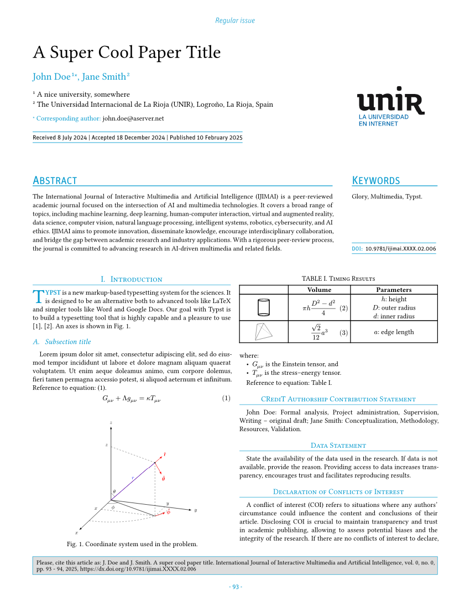
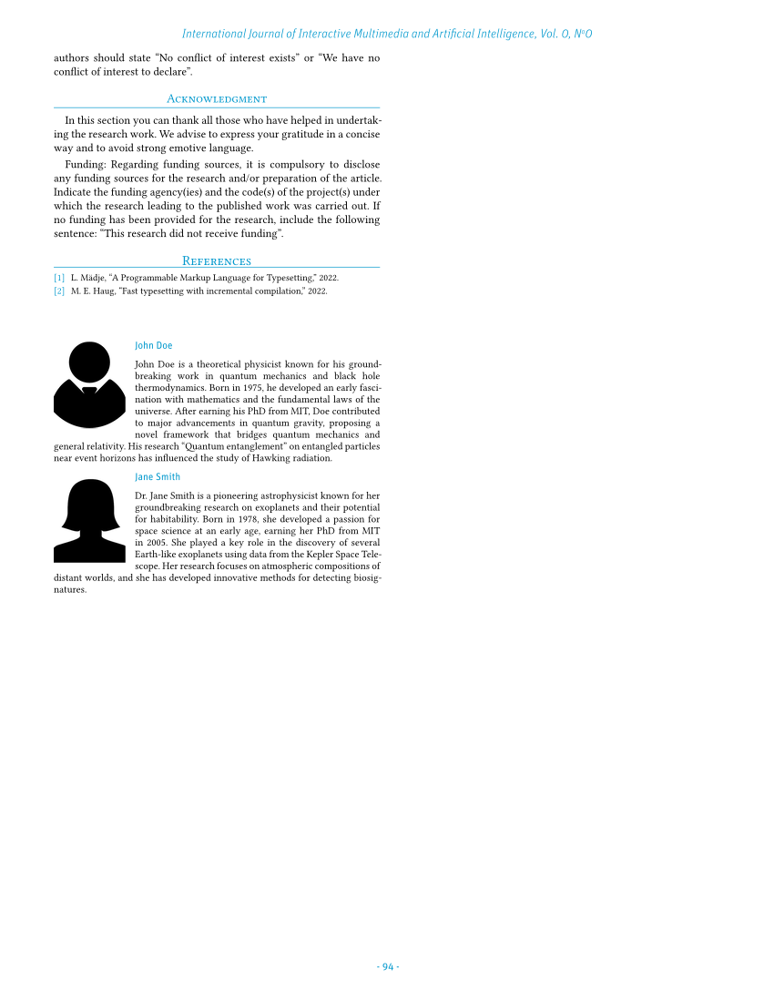

# Template for the _International Journal of Interactive Multimedia and Artificial Intelligence_ (IJIMAI)
The _International Journal of Interactive Multimedia and Artificial Intelligence_ ([IJIMAI](https://www.ijimai.org)) is a quarterly journal which provides an interdisciplinary forum in which scientists and professionals can share their research results and report new advances on artificial intelligence tools, theory, methodologies, systems, architectures integrating multiple technologies, problems including demonstrations of effectiveness, or tools that use AI with interactive multimedia techniques.

This template allows researchers to write and send papers to IJIMAI, directly written in Typst! IJIMAI is the first journal ever to accept contributions authored in Typst.

## Quick start
In order to use it, just read the TOML configuration file, import the template and apply a `show` rule:

```Typst
#import "@preview/ijimai:0.0.4": *
#let conf = toml("paper.toml")
#let author-photos = conf.authors.map(author => read(
  "photos/" + author.photo,
  encoding: none,
))
#show: ijimai.with(
  conf: conf,
  photos: author-photos,
  logo: image("unir logo.svg", width: 17.5%),
  bib-data: read("bibliography.bib", encoding: none),
)

= Introduction
#first-paragraph[Typst][is a new markup-based typesetting system for the sciences. It is designed to be an alternative both to advanced tools like LaTeX and simpler tools like Word and Google Docs.]

= CRediT authorship contribution statement
#format-credit-section()

= Data statement
= Declaration of conflicts of interest
= Acknowledgment
```

All the needed information is written in a [TOML](https://toml.io) conf file. Take a look at the example. Author photos are composed from their name and appending `.jpg` i.e., `John Doe` + `.jpg`.

If you do not have the Unit OT font, you can download it from the [repository](https://github.com/pammacdotnet/IJIMAI). Once done, upload the [`UnitOT-Regular.otf`] and [`UnitOT-LightItalic.otf`] files to your project directory in the [Typst.app](http://typst.app) web application. If you are using Typst locally, install font files in your operating system so that they are available to any program, alternatively use `--font-path` (paired with `--ignore-system-fonts`) flag and pass the directory with the downloaded fonts (see `typst compile --help`).

[`UnitOT-Regular.otf`]: https://raw.githubusercontent.com/pammacdotnet/IJIMAI/refs/heads/main/fonts/Unit OT/UnitOT-Regular.otf
[`UnitOT-LightItalic.otf`]: https://raw.githubusercontent.com/pammacdotnet/IJIMAI/refs/heads/main/fonts/Unit OT/UnitOT-LightItalic.otf

## Examples

### [Simple]

[][Simple] | [][Simple]
-|-

---

### [2 authors]

[][2 authors] | [][2 authors]
-|-

---

### [Regular issue]

[][Regular issue] | [][Regular issue]
-|-

[Simple]: ./tests/template/test.typ
[2 authors]: ./tests/template-2-authors/test.typ
[Regular issue]: ./tests/template-regular-issue/test.typ

## In case of doubts
Please, bear in mind this template is continously been bettered. In case of doubts, please, send an email to alberto.corbi@unir.net.
